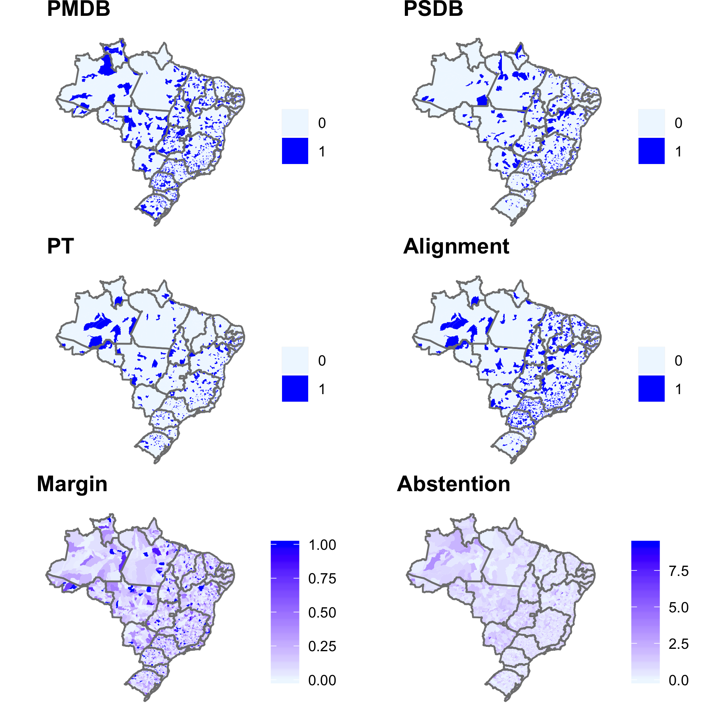
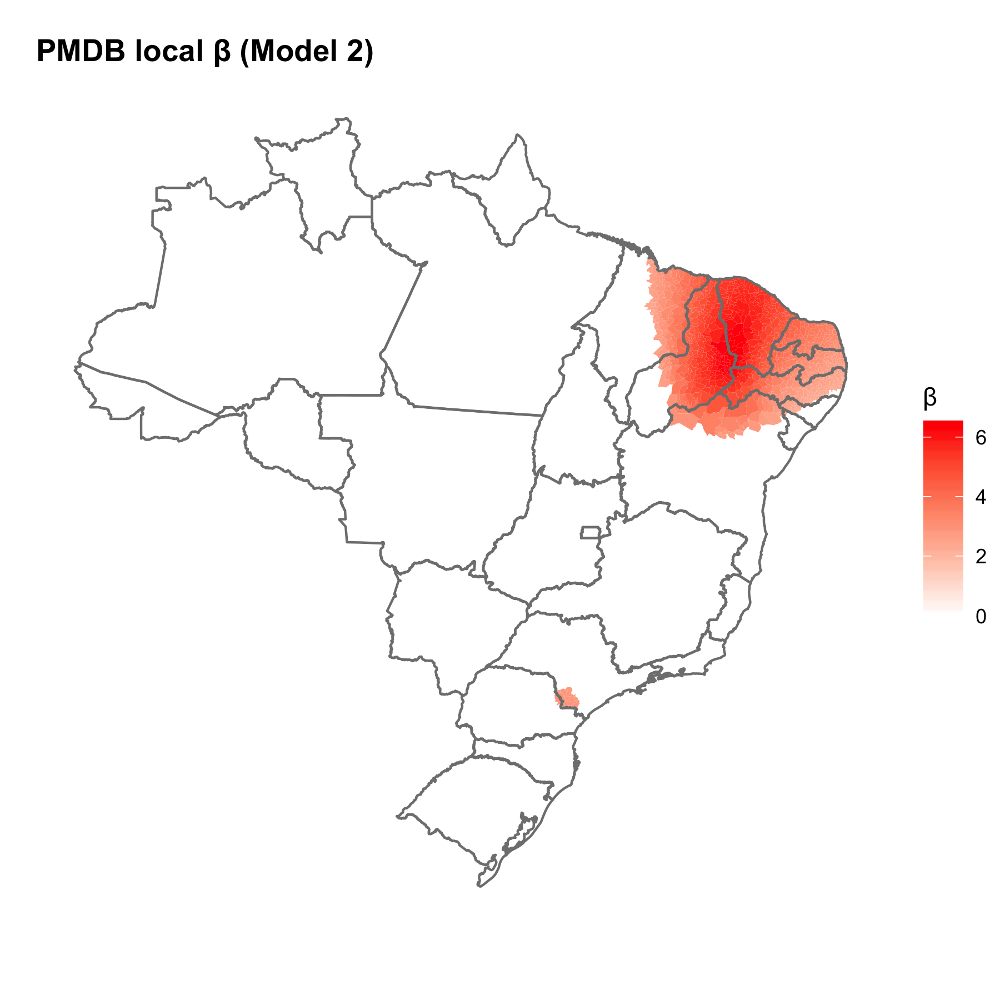
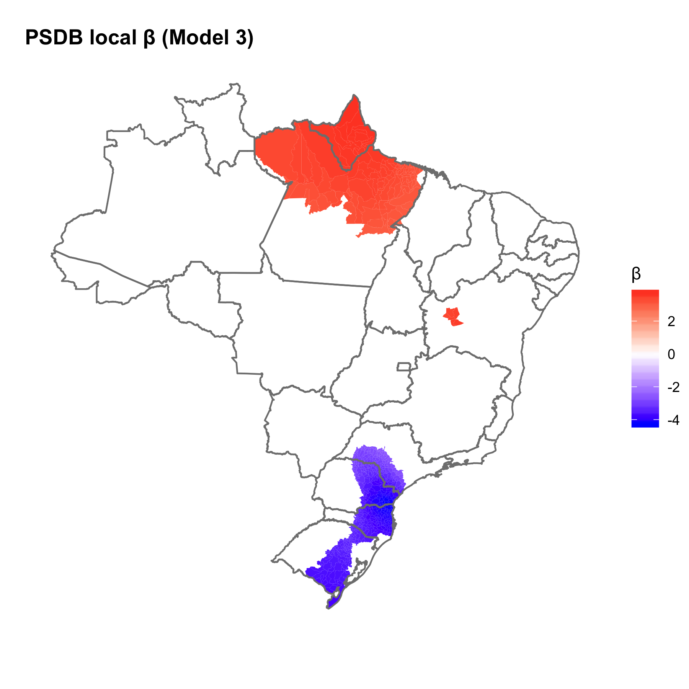
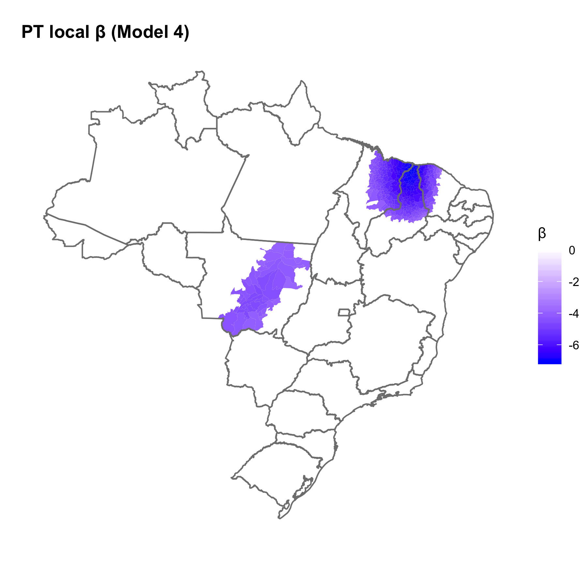
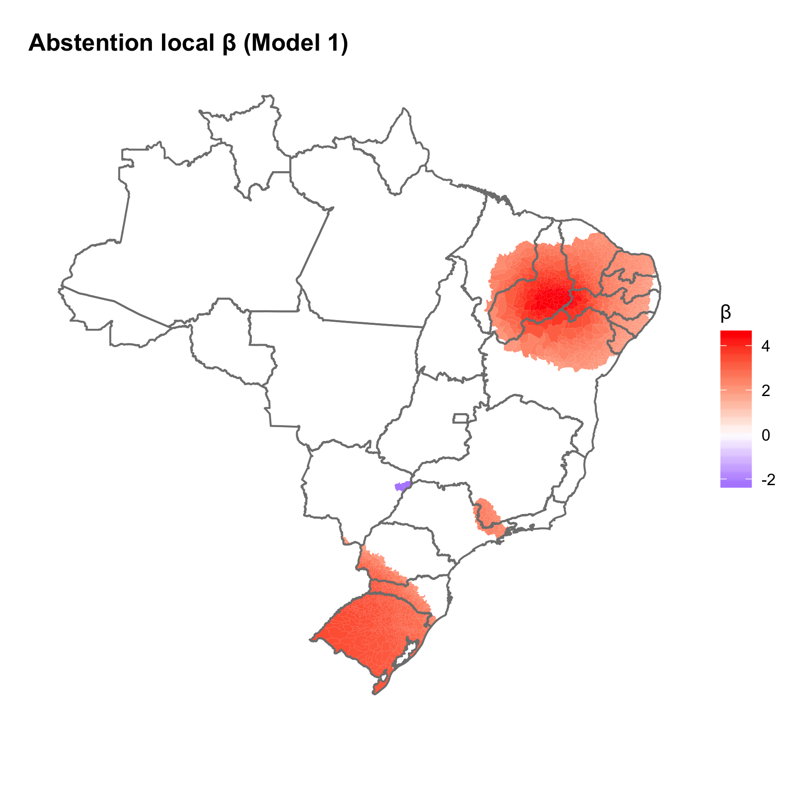
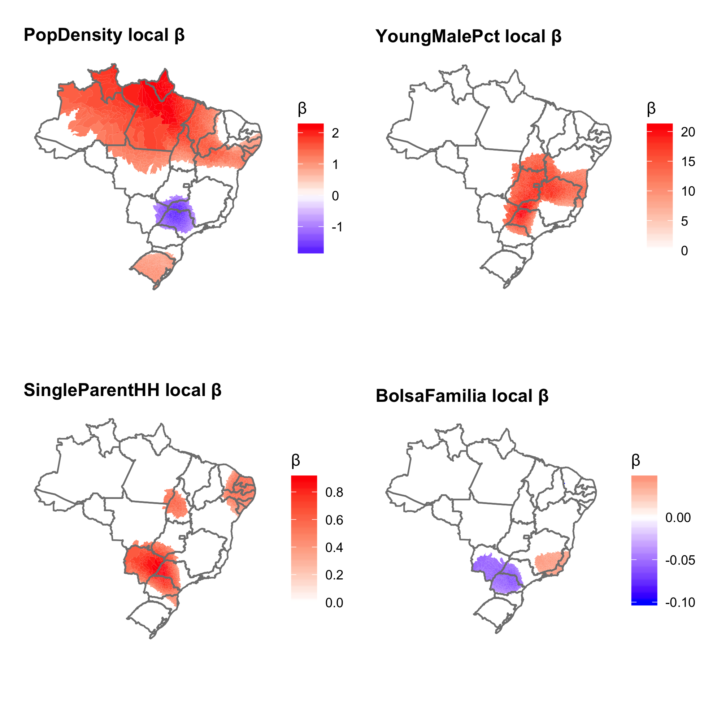
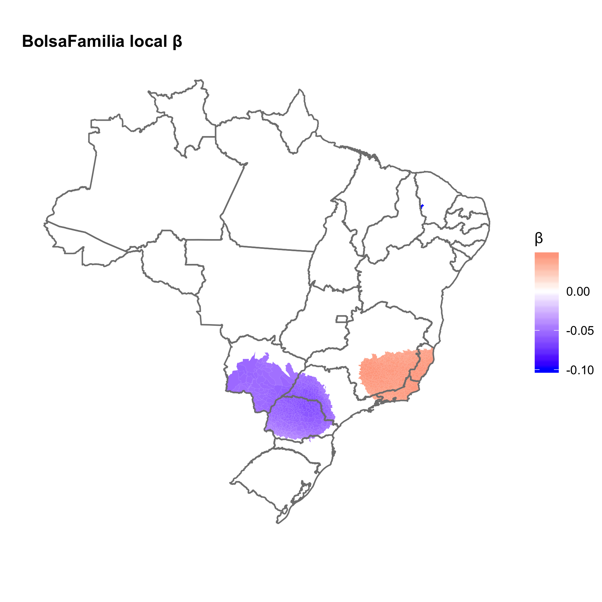

```{r setup, include=FALSE}
knitr::opts_chunk$set(echo = TRUE)
knitr::write_bib(c("knitr", "stringr"), "example.bib", width = 60)
knitr::opts_chunk$set(fig.pos = 'H')

#Load in libraries
library(knitr)
library(bookdown)
library(gt)
library(gtsummary)
library(rstanarm)
library(stargazer)
library(gapminder)
library(tidyverse)

# Load dataset
load("data.RData")
load("spatialdata.RData")
```


## Introduction

Matthew C. Ingram and Marcelo Marchesini da Costa’s (2019) paper offers a statistical analysis of the uneven, geographically-varying effect of municipal political predictors of violence across Brazil’s 5562 municipalities while controlling for dominant socio-structural accounts. More specifically, the authors investigate the local varying effect of four political variables --party identification of mayors, partisan alignment of mayors and governors, electoral competition, and voter participation—on homicide rates at the municipal level.

The outcome of interest—change in homicide rate—is measured as the difference in the two-year average of the homicide rate between 2011-2012 and 2007-2008. The change in homicide captures the change in violence over the four-year term of mayors who entered office in January 2009, and left office in December 2012, indicating if the mayor may have implemented actions that made their municipality more or less peaceful. Looking at the change in homicide variable across municipalities in Brazil, there is noticeable variation spanning positive and negative values, indicating that the location of the data observed may be important in predicting violence outcomes—that is, the political environment may have a differing effect on homicide rates in different municipalities. To understand this variation, determine if there may be an uneven effect of predictors of violence, and identify potential sources of unevenness, the authors use a geographically weighted regression, or GWR.

The GWR method produces local coefficients for predictors, allowing different relationships to exist at different points in space and facilitating the analysis of spatial heterogeneity (Charlton and Fotheringham, 2009). Spatial autocorrelation can be important in statistics when the locations of data are related to the data itself because many global tests assume all data is randomly distributed, or that the values at one location do not depend on values at other neighboring locations so that the location of the data points wouldn’t affect the information content of the data. Randomly distributed data are rare, and in many cases, this unmodeled heterogeneity is a serious form of model misspecification (Shoff, Chen and Yang, 2014).

The authors conduct two main tests using data on homicide rates from Brazilian ministry of health, data on political predictors comes from high electoral tribunal, and data for socio-structural controls from a variety of sources: (1) estimate four global ols models and test the stationarity of coefficients across space: and (2) visualize GWR models in a series of maps. Maps offer an alternative to tabular reports, better communicating the variation across local coefficients estimated by GWR analyses (Matthews & Yang, 2012).

The authors find that the effect of the party identification of mayors and voter participation show some  statistical significance and non-stationarity, suggesting an uneven geographically-varying effect on homicide. Neither partisan alignment of mayors and governors nor electoral competition are statistically significant. The authors focus on variables demonstrating non-stationarity for the GWR analysis. The explanatory variables include mayor's party affiliation and population density. The control variables include proportion of young males, single mother households, and Bolsa Familia coverage. GWR map analysis shows that the largest left party in Brazil, Workers’ Party (PT), had a beneficial effect, reducing violence in large parts of Brazil, the center party that held most local governments (PMDB) had a harmful effect in certain areas of Brazil, and the largest center-right party (PSDB) had mixed effects – helpful in some parts of Brazil and harmful in others. Lower voter participation was associated with higher homicide in large parts of the northeast and south. The authors synthesize these findings with a small case study to suggest that the municipal’s government’s partisan alignment with the federal government may explain this heterogeneity, because in the period studies, the federal government was affiliated with the Workers’ Party (PT).

To replicate this analysis and conduct my own analysis, I use R, an open source programming language. Ingram and Costa’s original code and data are made publically available on the Harvard Dataverse.^[[Original replication data and code](https://dataverse.harvard.edu/dataset.xhtml?persistentId=doi:10.7910/DVN/NX5QIU&version=1.2)] Running the original code, I produced and exported the tables and figures detailing the results of the paper, namely the global ols results, and GWR map visualizations for explanatory variables of interest. Please see the Appendix (Section 0.6) for the replication. I failed to reproduce the Monte Carlo tests because of computing restraints. Diving deeper, I examine the authors’ claims that the non-stationarity of the relationship between mayor party identification and homicide rates is a result of municipality-federal party alignment. I run an OLS regression with interaction effects to predict the effect of a federal social program on homicide rates, given municipality-federal party alignment. I do not find support for the author’s proposed explanation. Extension (Section 0.4) provides a more detailed explanation of this analysis. The Appendix (Section 0.6) provides the results of this regression. All analysis for this paper is available in my github repo. ^[[Katie Cao Github Repo](https://github.com/ka1on/gov1006final)]

## Literature Review
Past research examining predictors of lethal violence has focused on socio-structural accounts emphasizing demographic, economic, and environmental factors. The authors contribute to the literature by examining the role of electoral and partisan politics, which has received little attention previously. In addition, the authors approach this analysis with special attention to spatial interdependence, which is a rising trend in social sciences.

To review, the authors focus on four political variables --party identification of mayors, partisan alignment of mayors and governors, electoral competition, and voter participation. The authors expect that more programmatic parties on the left or right, will reduce violence relative to centrist parties because existing research shows programmatic parties emphasize crime and public safety in their platforms (Ingram, 2016). Prior research regarding partisan alignment shows that policy coordination and funding are better with municipality-state party alignment, so alignment is expected to reduce violence (Montero, 2004). Electoral competition has been found to improve government performance across many areas and thus is expected to reduce violence (Hoelscher, 2015). Voter participation is expected to exert downward pressure on violence because of it's association with improvements to social organization (Putnam, Leonard and Nanetti, 1994).

Spatial analysis has become more and more important in the social sciences as researchers recognize the complexity and hidden interdependence of predictors. In datasets with high spatial autocorrelation, with geographic clustering of similar values, a global ols may show innacurate results because either certain explanatory variables are behaviorally different in different locations, or (b) there is a local, unobserved factor present. Thus, the authors approach their examination of the political variables of interest, as well as many traditional socio-structural control varaibles, from a spatial perspective.

## Replication
The authors generously made their data and code available on Dataverse and is written in R. I was able to replicate almost all the main findings in the Results and Discssion section of the paper. These results, viewable in the Appendix (Section 0.6), include a global OLS regression with four models of varying specifications to test robustness (Table 1), a map visualization of key explanatory variables (Figure 1), and GWR map visualizations for the explanatory variables and control variables that demonstrated non-stationarity (Figures 2-6). I executed the majority of analysis in a separate R script and exported the figures as images to include in this paper because the full dataset is large and takes very long to load. To demonstrate my understand of the code executed, I parsed through the 1800 lines of code in the original replication file to isolate the minimal code necessary to replicate the 4 global OLS results and GWR map visualizations; this abridged version of the code is available in my Github repo under "analysis.R".

I failed to replicated the Monte-Carlo tests for stationarity preformed on the global OLS regression that was used to identify predictors that vary by magnitude, statistical significance, and even direction across municipalities. As detailed by the authors in their ReadMe file, the code includes 5 Monte Carlo tests that take approximately 25 hours to run. My several attempts to run these tests all resulted in either R crashing or the tests running for over 25 hours without completing. I could not track down the cause of this issue and was ultimately not able to include the results.

## Extension
In Section 5.1 of Ingram and Costa's paper, the authors synthesize GWR analysis with a qualitative case study of PT mayors to suggest an explanation for how the party affiliation of a mayor influences violence. To review, the paper showed that the largest left party in Brazil (PT) appeared to reduce violence in large parts of Brazil, unlike the the center party (PMDB) which increased violence in certain areas of Brazil, and the largest center-right party (PSDB) which had mixed effects. The authors suggest the positive effect of PT mayors may be a result of municipality party alignment with the federal government. According to interviews with former PT mayors and advisors, municipalities are highly dependent on the federal government. The federal government was largely affiliated with the PT party during the period of interest of the study, 2009-2012. The authors suggest the PT federal government offered more funding and programmatic support to municipalities with PT mayors, and the PT mayors in turn were more supportive of federal policies and initiatives, resulting in more success in reducing violence.

To test this explanation, I examine the effect of Bolsa Familia (BF), a conditional cash transfer program implemented at the time of the study. Because BF mandates participation in school and health programs, fostering social organization, it has been shown to reduce violence with some mixed results (Lance, 2014). Indeed, a GWR following the methodology of Ingram and Costa examining the the effect of BF coverage on homicide shows that BF has mixed statistically significant coefficients in Brazil.

Following the explanation proposed by the author, we would expect that this spatial heterogeneity is explained by municipality party alignment with the federal government. In line with the author's logic, we may hypothesize that municipalities with mayors with the same party as the federal government (PT) get better support and execute BF better, decreasing homicide, while non PT municipalities struggle to foster social organization through the program and do not decrease violence. An ols regression with interaction effects between having a PT mayor and BF coverage tests this hypothesis. The results, as seen in Table 1, show that the interaction term is not significant. In fact, the coefficient on the interaction term is positive, meaning an increase in violence, though non-significant. Though this doesn't disprove the author's proposed explanation, it's clear that unexplained heterogeneity remains in the model.

These results highlight a limitation of GWR: identifying causal pathways for any observed phenomena. GWR is most useful in two ways. First, is a great exploratory tool for detecting spatial phenomena initially. Second, it can help build a relevant model by identifying spatial non-stationarities that may interfer with the global model (Bellefon and Floch, 2018). Namely, observing significant coefficients on PT in some parts of Brazil, does not indicate that mayor affiliation is a causal factor in homicide rates. On the contrary, the incosistency of statistical significance across space indicates that there must be other unobserved factors interaction with or being observed through the PT variable. Though the author's proposed explanation of municipality-federal alignment is compelling in some ways, further research must be done to fully understand the relationship between political variables and homicide and identify causal mechanisms.

## Conclusion

I replicated the findings of Matthew C. Ingram and Marcelo Marchesini da Costa’s (2019) investigation of the geographically varying effect of politics on homicide rates in Brazil. Explanatory variables, both political and socio-structural were found to vary over different municipalities, such as non-stationary variables such as the mayor's party affiliation, population density, proportion of young males, single mother households, and Bolsa Familia coverage. Traditional OLS regressions cannot account for this spatial heterogeneity, motivating the authors' use of a geographically weighted analysis. By constucting a separate OLS equation for every location in the dataset, the GWR accounts for the uneven effect of predictors of violence across space. Most notably, the GWR finds that the largest left party in Brazil (PT) appeared to reduce violence in large parts of Brazil, unlike the the center party (PMDB) which increased violence in certain areas of Brazil, and the largest center-right party (PSDB) which had mixed effects. I was able to replicate all the figures and results in the paper's results section using R, except for the Monte Carlo tests for stationarity.

In my extension, I test the author's claim that mayors in the PT party are better able to reduce violence because of political alignment with the PT federal government at the time. I investigate the effect of a federal program, Bolsa Familia on homicide with consideration to the political alignment explanation, hypothesizing that if the authors were correct, then municipalities with PT mayors would better execute the federal government's Bolsa Familia initative than non PT mayor municipalities, resulting in lower homicide rates. I utilize an OLS regression with interaction effects between PT mayors and Bolsa Familia coverage predicting change in homicide rates, but find no significance in the interaction term. I conclude that while GWR analysis is an extremely useful tool in identifying spatial heterogeneity that may cause misspecification in a global ols regression, GWR is very limited in testing causal pathways. Thus, more research will have to be draw a causal pathway between municipal politics and violence because we fully understand the political geography of violence.

\newpage
## Appendix

```{r, echo=FALSE, results='asis', message=FALSE, out.height="80%"}
stargazer(ols1m, ols2m, ols3m, ols4m,
          keep.stat = c("n", "rsq", "adj.rsq", "aic"),
          column.labels = c("Model 1", "Model 2", "Model 3", "Model 4"),
          dep.var.caption = "OLS Models Depdendent Variables",
          dep.var.labels = "Change in Homicide Rate (HR Change)",
          covariate.labels = c("Margin of Victory", "Alignment", "Abstension",
                               "PMDB", "PSDB", "PT", "PopDensity",
                               "YoungMalePct", "GINI", "HDI", "SingleMotherHH",
                               "Employment", "BolsaFamilia"),
          table.placement = "H",
          font.size="footnotesize",
          header=FALSE)
```

```{r keypredictors, echo=FALSE, fig.cap="Geographic Distribution of Key Explanatory Variables.", out.width = '100%'}

```

```{r PMDB, echo=FALSE, fig.cap="Local coefficients for PMDB (GWR Model 2).", out.width = '100%'}

```

```{r PSDB, echo=FALSE, fig.cap="Local coefficients for PSDB (GWR Model 3).", out.width = '100%'}

```

```{r PT, echo=FALSE, fig.cap="Local coefficients for PT (GWR Model 4).", out.width = '100%'}

```

```{r kp, echo=FALSE, fig.cap="Local coefficients for Abstention (GWR Model 1).", out.width = '100%'}

```

```{r controls, echo=FALSE, fig.cap="Local coefficients for non-political control variables (GWR Model 1).", out.width = '100%'}

```

```{r bf, echo=FALSE, fig.cap="Local coefficients for Bolsa Familia (GWR Model 1).", out.width = '100%'}

```

```{r extension, echo=FALSE, results='asis', message=FALSE, out.height="80%"}
ols_ext <- formula(
  DifHRElec ~ CoverBF + PT + CoverBF*PT + margin + stalign + Abstention +
    lpopdensity + lpctpopym + 
    GINI + IDHM + 
    HHsinpar + Ocup18male
)
ols_ext <- lm(ols_ext, data=shpbra@data)
stargazer(ols_ext, title = "Bolsa Familia and Mayor Party Affiliation",
          table.placement = "H",
          covariate.labels = c("BolsaFamilia", "PT", "Margin of Victory",
                               "Alignment", "Abstension", "PopDensity",
                               "YoungMalePct", "GINI", "HDI", "SingleMotherHH",
                               "Employment", "BolsaFamilia x PT"),
          font.size="footnotesize",
          header=FALSE)
```
## References